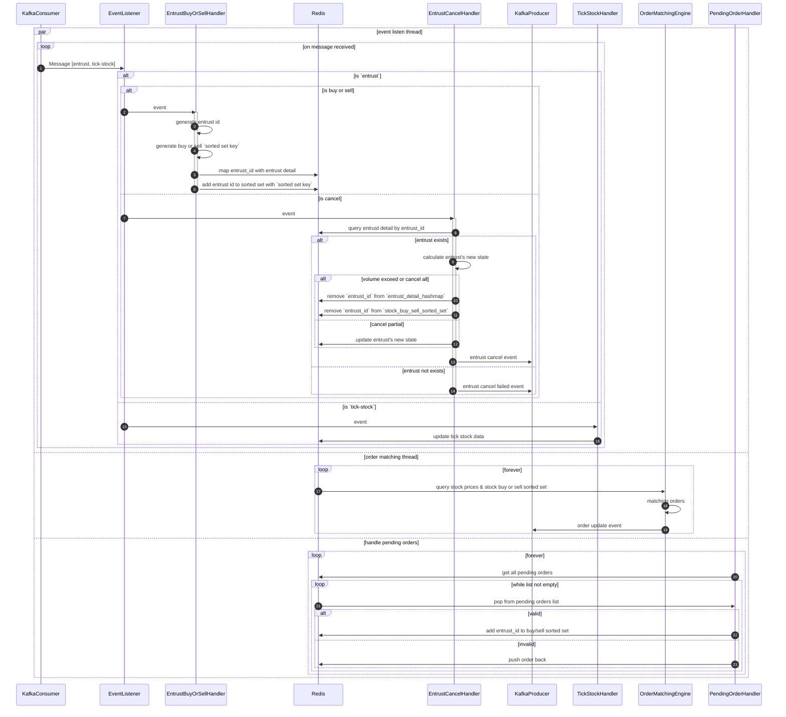

## 架构

```mermaid
sequenceDiagram
	autonumber

	par event listen thread
    loop on message received
      KafkaConsumer ->> EventListener: Message [entrust, tick-stock]
      alt is `entrust`
        alt is buy or sell
          EventListener ->> EntrustBuyOrSellHandler: event
          activate EntrustBuyOrSellHandler
          EntrustBuyOrSellHandler ->> EntrustBuyOrSellHandler: generate entrust id
          EntrustBuyOrSellHandler ->> EntrustBuyOrSellHandler: generate buy or sell `sorted set key`
          EntrustBuyOrSellHandler ->> Redis: map entrust_id with entrust detail
          EntrustBuyOrSellHandler ->> Redis: add entrust id to sorted set with `sorted set key`
					deactivate EntrustBuyOrSellHandler
        else is cancel
          EventListener ->> EntrustCancelHandler: event
          activate EntrustCancelHandler
          EntrustCancelHandler ->> Redis: query entrust detail by entrust_id
          alt entrust exists
            EntrustCancelHandler ->> EntrustCancelHandler: calculate entrust's new state
            alt volume exceed or cancel all
              EntrustCancelHandler ->> Redis: remove `entrust_id` from `entrust_detail_hashmap`
              EntrustCancelHandler ->> Redis: remove `entrust_id` from `stock_buy_sell_sorted_set`
            else cancel partial
              EntrustCancelHandler ->> Redis: update entrust's new state
            end
            EntrustCancelHandler ->> KafkaProducer: entrust cancel event
          else entrust not exists
            EntrustCancelHandler ->> KafkaProducer: entrust cancel failed event
          end
          deactivate EntrustCancelHandler
        end
      else is `tick-stock`
        EventListener ->> TickStockHandler: event
        TickStockHandler ->> Redis: update tick stock data
      end
    end

	and order matching thread
		loop forever
      Redis ->> OrderMatchingEngine: query stock prices & stock buy or sell sorted set
      OrderMatchingEngine ->> OrderMatchingEngine: matching orders
      OrderMatchingEngine ->> KafkaProducer: order update event
		end

	and handle pending orders
		loop forever
			PendingOrderHandler ->> Redis: get all pending orders
			loop while list not empty
				Redis ->> PendingOrderHandler: pop from pending orders list
				alt valid
					PendingOrderHandler ->> Redis: add entrust_id to buy/sell sorted set
				else invalid
					PendingOrderHandler ->> Redis: push order back
				end
			end
		end

	end
```

## 对象

